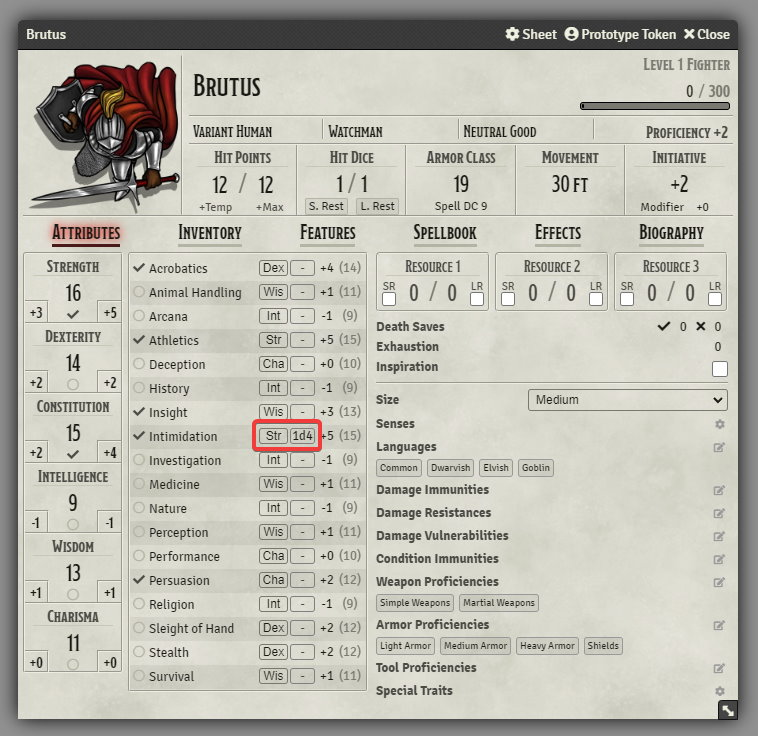

# FVTT-Skill-Customization-5e

Gives the ability to apply arbitrary flat bonuses to skill rolls as well as changing the base ability modifier a skill roll uses.

## Preview

As you can see, this module adds a drop down to select the base ability, as well as a box to enter an arbitrary bonus to each skill.

## Caveats

Probably doesn't work with other actor sheets right now.

## License

Licensed under the GPLv3 License (see [LICENSE](LICENSE)).
